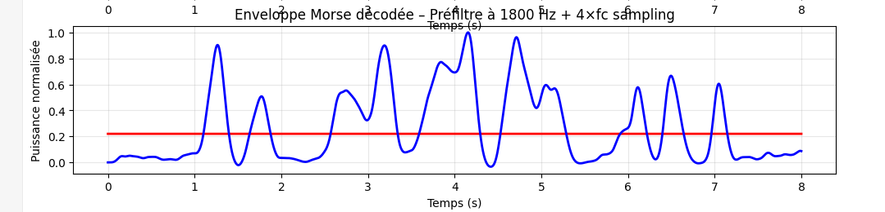
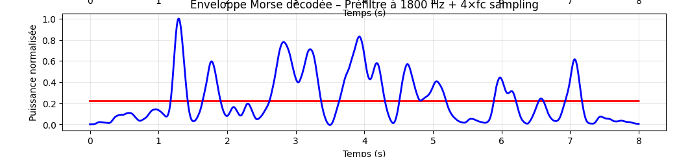
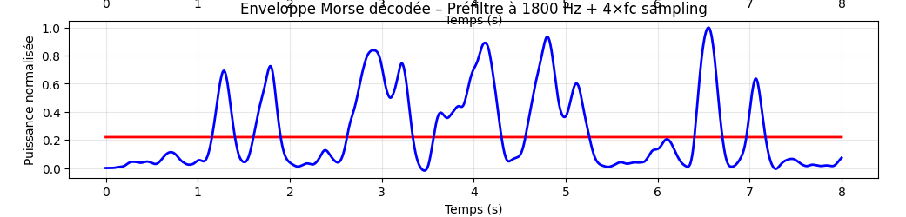

Another morse decoder

The goal is to be able to decode a morse signal in a -20db snr environment.

This is work in progress.

## User Interface

The TFT display (320x240, ILI9341) is divided into three zones:
- **Top**: Decoded Morse text output (3 lines)
- **Middle**: Menu with 4 output channel selectors (Out Left, Out Right, Out PWM 1, Out PWM 2)
- **Bottom**: Software version

A rotary encoder navigates the menu; pushing it enters/exits parameter edit mode where each output can be assigned one of 9 internal signal sources from the coherent demodulator.

### Pin usage
| Pin | Function |
|-----|----------|
| 0, 3 | Rotary encoder (rotation) |
| 4 | Rotary encoder push button |
| 1 | TFT RST |
| 2 | TFT DC |
| 5 | LED |
| 10-13 | TFT SPI (CS, MOSI, MISO, SCLK) |
| 22 | PWM audio output 1 |
| 23 | PWM audio output 2 |

## Signal Processing

Processing in python seems to work, see below 10WPM @ -20db snr, transmit data is : "ios" (.. --- ...)

